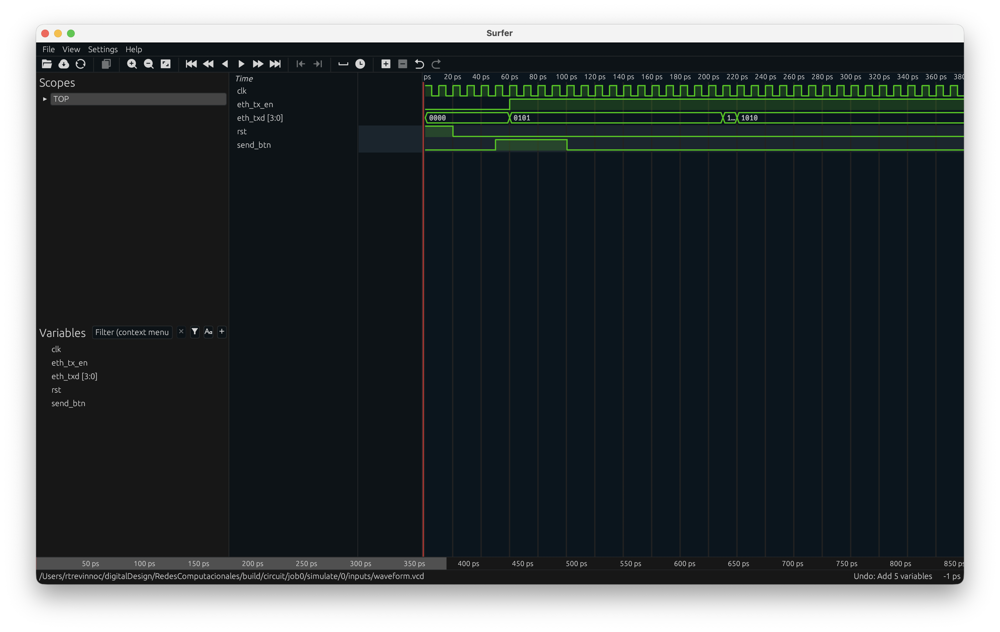

# Cuadro de Ethernet Malformado

## Configuración

Para correr el ejemplo, por favor primero instalen el siguiente paquete de python:
```sh
pip install siliconcompiler
```

Posteriormente, deberán de instalar un par de herramientas, [Verilator](https://www.veripool.org/verilator/) y [Surfer](https://surfer-project.org).

## Ejecución

Habiendo instalado lo anterior, pueden ejecutar el siguiente comando:
```sh
python make.py
```

## Visualización

Despues ejecutar la verificación y la simulación del modulo que diseñamos, les presentará el siguiente archivo:



Si lo prefieren, pueden hacer directamente la visualización de [waveform.vcd](waveform.vcd) en la página de [Surfer](https://surfer-project.org), sin necesidad de descargar el programa ya que nos proporcionan una versión en WebAssembly.